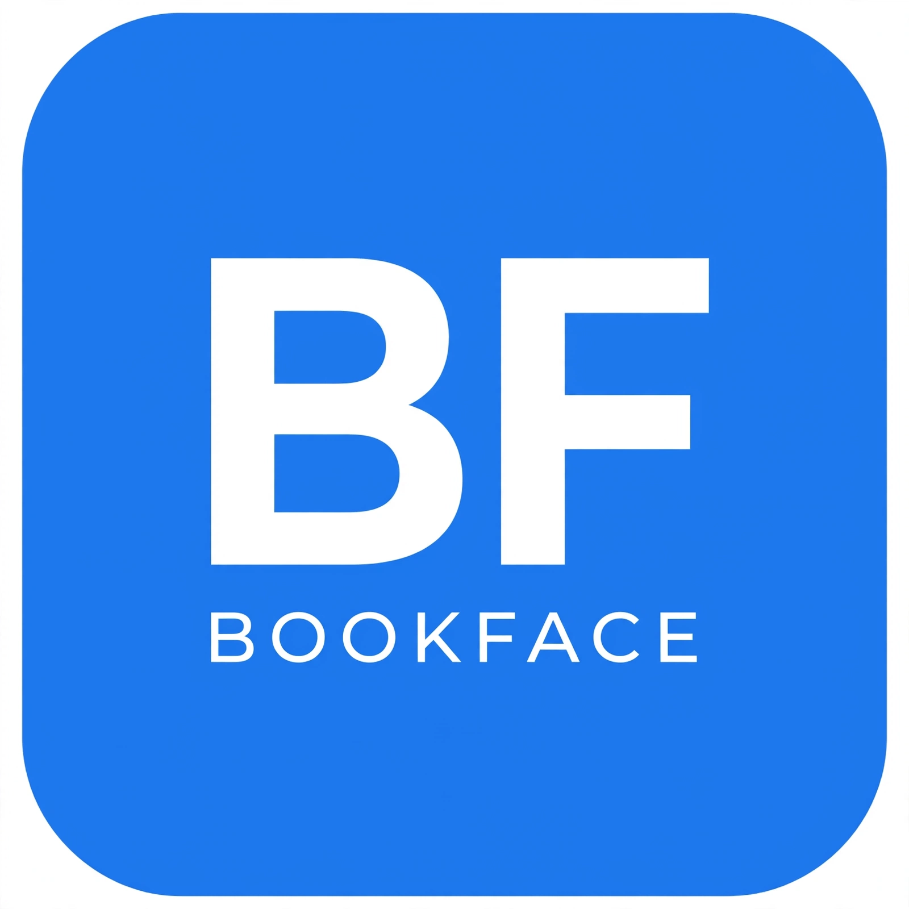

# 🔵 BookFace
### BF • BOOKFACE — Real Faces, Real Connections

> **Brand Owner:** Kelvin Onomuaborigho
> **Email:** bookfacedating@gmail.com
> **Live:** https://niyyahbook101.github.io/bookface/

## Brand Identity

**Logo Concept:**
- Monogram: **BF** — Bold White, Extra-Bold Sans
- Wordmark: **BOOKFACE** below BF
- Meaning: Trust, Clean, Facebook-level professional

**Colors:**
- Primary Blue: `#1877F2` (Facebook Blue)
- White: `#FFFFFF`
- Feed Background: `#E7F3FF`
- Shape: Rounded square, 22% radius, 1:1 ratio

**Typography:**
- Font: Arial Black / Inter ExtraBold
- BF Weight: 900, BOOKFACE Weight: 700
- All caps, clean, app-icon readable

## About
BookFace is a social connection platform — real people, real photos, no grey boxes. Like Facebook but for intentional, real connections.

## Features
- 🔵 Blue professional design
- 🖼️ Real feeds (For You / Following / Groups)
- 🤍 Matches (coming soon)
- 💬 Chat (coming soon)
- 👥 Groups

## Tech
- HTML/CSS/JS
- GitHub Pages hosting
- Waitlist connected to bookfacedating@gmail.com

## Owner
© 2026 BookFace — Built by Kelvin Onomuaborigho

**BF — Tough, Clean, Social.**
